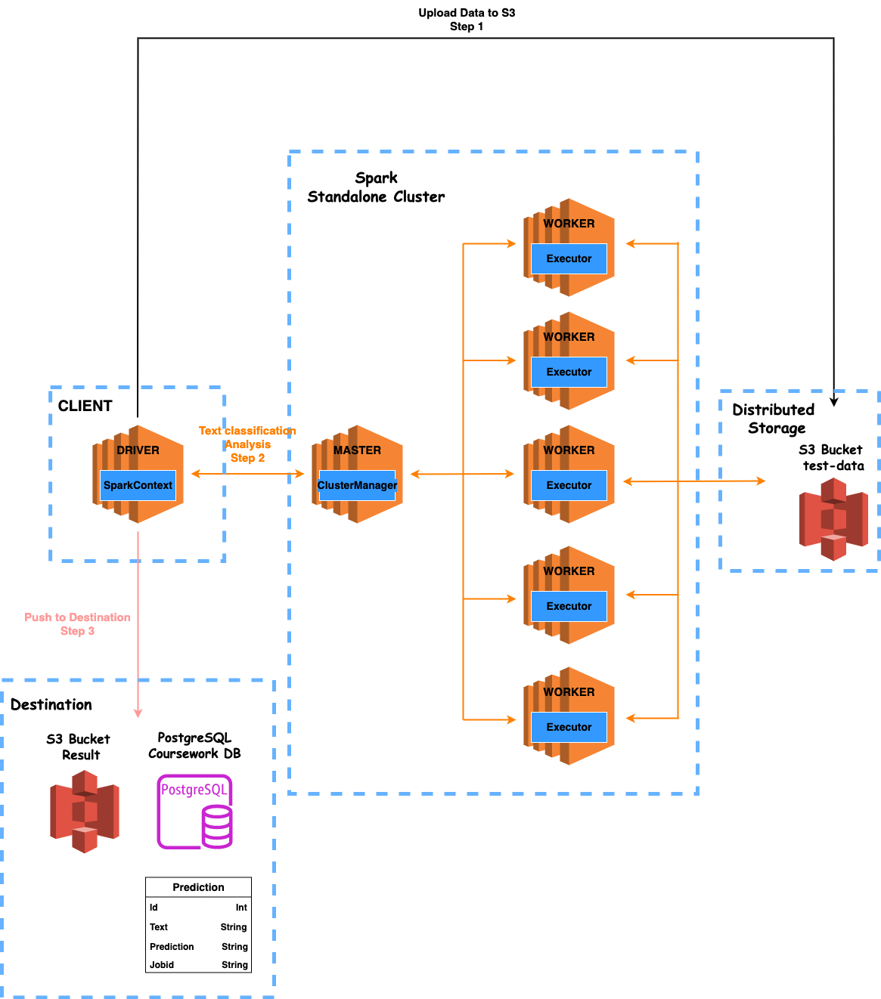

# Batch Processing System based on spark

This project provides a robust solution for batch processing using Apache Spark and Ansible for infrastructure management. For demonstration purposes, a sentiment analysis pipeline using the BERT language model has been deployed. Designed to utilize the power of distributed computing for NLP, the project comes in two parts: the application codebase for the text classification service and the infrastructure as code (IaC) using Ansible to set up and manage the Spark infrastructure.

## Getting started
You can access the front end by [Sentimental analysis by spark](http://18.171.239.205:4200/)

## Project Structure

1.  [**Part 1 Text Classification Service and App**](./analysis/README.md)
2.  [**Part 2: Spark Infrastructure with Ansible**](./config/README.md)

## Workflow
This diagram provides a visual representation of the end-to-end process, from data ingestion to processing, and output. 

